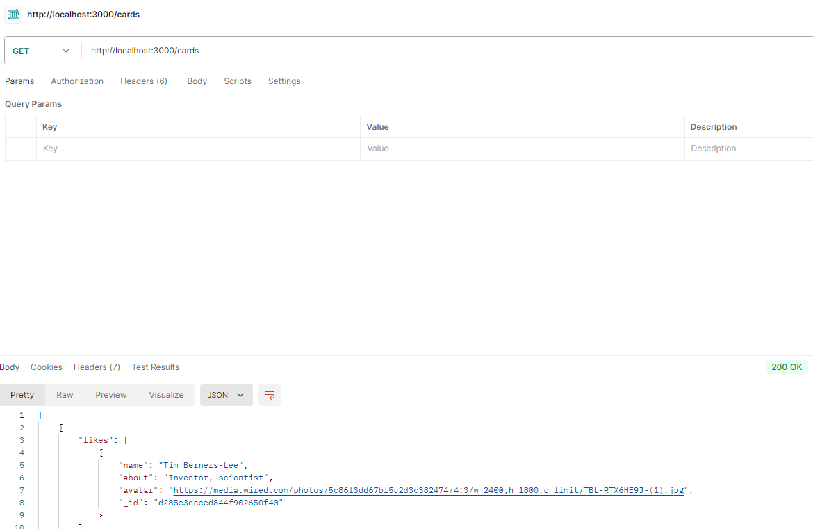

# Tripleten web_project_around_express

este proyecto se implementa codificacion para backend, es decir, codificacion para respuesta de la Api, en este caso solo para request GET.

se usan express y modulos FS para la lectura de los Json, tambien se usan los modulos Path junto con el metodo join para establecer las rutas normalizadas.

